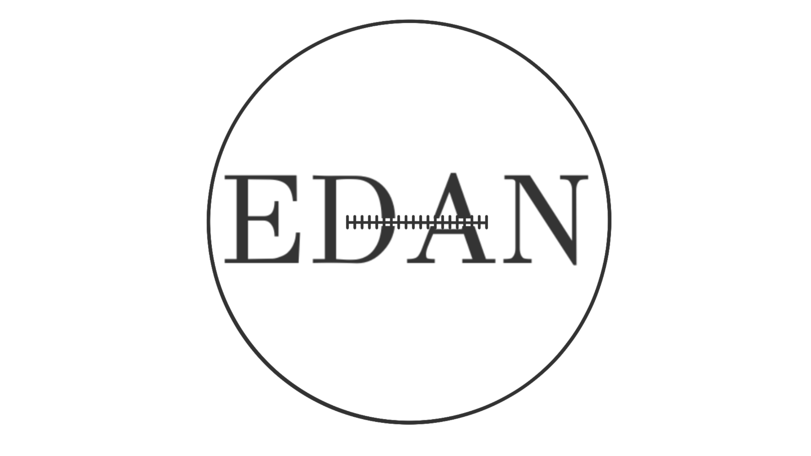
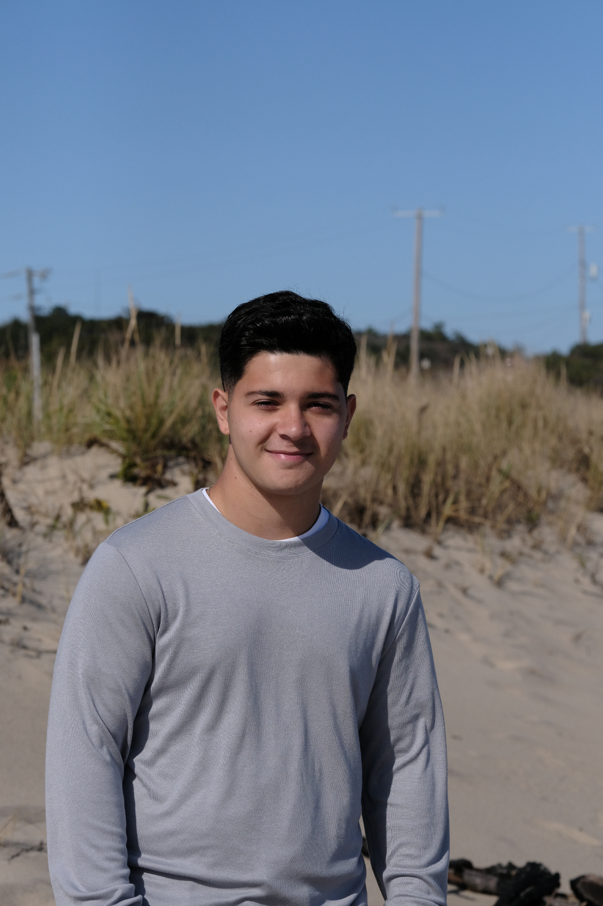

# EDAN

<p align="center">
  
</p>

EDAN is a React + TypeScript web app for custom screen-printing orders, with a PHP + MySQL backend for order creation, tracking, and admin management.

## Team

<p>
  
  
  
</p>

- **David Sargsyan** - Creative director, mainly working on UX and assists with frontend and backend when needed.
- **Toby Dokyi** - Working on main structure/layout of the website, as well as the overall frontend and animations.
- **Josh** - Team contributor.

## Features

- Customer order form with validation and optional design upload.
- Track orders by `EDAN-<id>` or email.
- Admin authentication and protected admin dashboard.
- Admin order management: list, filter, update status, delete.
- Lottie-powered animations on the About page.

## Tech Stack

- **Frontend:** React, TypeScript, Vite, Tailwind CSS, React Router, React Query
- **Backend:** PHP (JSON API), MySQL
- **Validation/UI:** Zod, React Hook Form, shadcn/ui, Radix UI

## Project Structure

- `src/` - React frontend app
- `edan-backend/api/v1/` - PHP API endpoints
- `edan-backend/sql/init.sql` - Database schema
- `public/lottie/` - Lottie animation files

## Local Development

### 1) Frontend

```bash
npm install
npm run dev
```

Frontend runs at `http://127.0.0.1:5173`.

### 2) Backend

- Host `edan-backend` under Apache (XAMPP/WAMP/MAMP) so this path works:
  - `http://localhost/edan-backend/api/v1/health.php`
- Create DB/tables using:
  - `edan-backend/sql/init.sql`

### 3) Admin Access

- Login route: `http://127.0.0.1:5173/admin/login`
- Admin route: `http://127.0.0.1:5173/admin`

## Status Values

- `received`
- `in-progress`
- `completed`
- `rejected`
